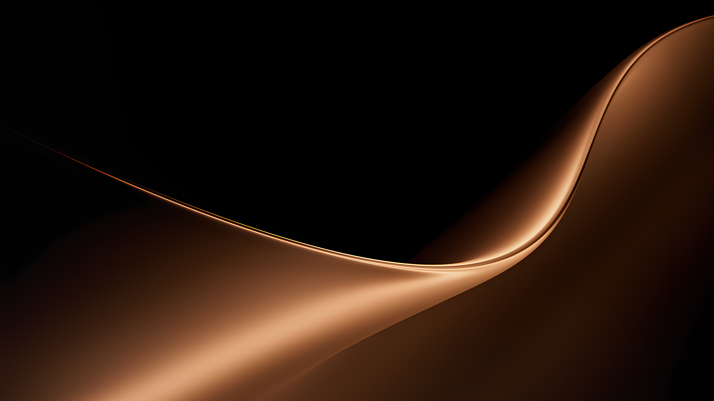

# Soulfly

Тёмная палитра Omarchy: почти чёрный фон `#080706`, песочный текст `#ECC18E`,
медно-розовый акцент `#ac6766`, золотистые и терракотовые цвета синтаксиса.
Источник системных цветов — `colors.toml`. У выделенного текста сохранён светлый цвет,
чтобы он оставался читаемым на фоне `#1a1a1a`.



## Установка

```sh
omarchy theme install https://github.com/pridees/omarchy-soulfly-theme.git
```

Тема установится под именем `soulfly`. Дополнительные интеграции Zed и Zen
подключаются вручную по инструкциям ниже; Telegram импортируется отдельно.
Перед установкой hooks перейти в каталог `~/.config/omarchy/themes/soulfly`.

## Схемы

| Файл | Приложение |
| --- | --- |
| `nvim/soulfly.lua` | Neovim / LazyVim: адаптер самостоятельной colorscheme Soulfly |
| `zed.json` | Zed: интерфейс, синтаксис, диагностика, терминал |
| `vscode-theme.json` | VS Code, VSCodium, Cursor через интеграцию Omarchy |
| `alacritty.toml` | Alacritty |
| `kitty.conf` | Kitty |
| `ghostty.conf` | Ghostty |
| `foot.ini` | Foot (секция `colors-dark`) |
| `helix.toml` | Helix |
| `btop.theme` | btop |
| `obsidian.css` | Obsidian: CSS-сниппет для тёмного режима |

## Zed / Omazed

Zed основан на **Ayu Darker 1.1.2 (K4YT3X)**, с отдельной семантической
палитрой Soulfly. Интерфейс адаптирован по Aether: рабочая область `#090908`,
панели `#0f0f0e`, активные вкладки `#1a1a18`, всплывающие поверхности `#191917`,
тонкие границы `#20201d` и розовый акцент `#ac6766`.

`zed.json` содержит актуальное оформление Zed. `ide-colors.toml` — базовая
палитра для более ранних экспортов VS Code и Helix; их синтаксис отличается
от окончательной семантической палитры Zed.

Для hook нужны установленные Omazed, `jq` и Omarchy.

Установить hook из каталога темы:

```sh
omarchy hook install theme-set hooks/omazed
omarchy theme set soulfly
```

Hook заменяет стандартный `theme-set.d/omazed`. Для Soulfly он копирует готовый
`zed.json` в `~/.config/zed/themes/omazed.json` под именем **Omazed**.
Основной текст интерфейса — `#c6beb2`, вторичные подписи и обычные иконки —
`#968979`. Песочный акцент интерфейса наследуется из активного `colors.toml`.
Цвета кода задаются независимо от палитры ОС: обычные идентификаторы нейтральные,
вызовы голубые `#72bfff`, типы, интерфейсы и классы лавандовые `#c792ff`,
строки зелёные `#b5d86d`, именованные константы золотистые `#efc16e`.
Имена полей и обращения к ним выделены насыщенным розовым `#E58EA5`.
Числа, встроенные константы (`null`, `undefined`) и escape-последовательности
окрашены в тёплый оранжевый `#d9976e`.
Все ключевые слова, включая импорты и объявления, песочные `#ECC18E`;
управляющие конструкции дополнительно выделены весом 500.
Пунктуация нейтральная; цвета вложенности скобок ограничены тремя спокойными оттенками.
Текст встроенного терминала нейтральный `#c0bfba`; inlay-подсказки песочно-коричневые
`#997d5c`, `syntax.hint.font_weight = 300`. Комментарии — `#8a8e85`.

Обычные импортируемые имена в Tree-sitter TypeScript размечаются как `variable`,
а `import type` — как `type`: схема следует этим ролям. Языковой сервер и другие
языки могут давать иную разметку. Цвет дополняет синтаксис, отступы и имена;
он не является самостоятельным доказательством поведения кода.
Источник правил: https://github.com/zed-industries/zed/blob/main/crates/grammars/src/typescript/highlights.scm

Для других тем вызывает штатный `omazed set`. В настройках Zed выбрать **Omazed**.
Прямой вызов `omazed set soulfly` обходит hook и возвращает обычную генерацию;
для синхронизации использовать переключение темы Omarchy.

Источник адаптации: <https://github.com/k4yt3x/zed-theme-ayu-darker>.
Изменённая тема `zed.json` распространяется по GPL-3.0; текст лицензии сохранён
в `LICENSE-Ayu-Darker`. Изменения Soulfly: 2026-10-02, палитра, поверхности,
синтаксис, статусы, терминал и имя Omazed.

## Neovim / LazyVim

Самостоятельная colorscheme **soulfly** с фиксированной палитрой. Не читает
`zed.json`, не требует Zed, Aether или Omarchy. Стандартная структура Neovim:
`colors/soulfly.lua`, `lua/soulfly/`, группы Vim syntax, Tree-sitter, LSP,
диагностика, терминальные ANSI-цвета и оформление основных UI-плагинов.

Установка из каталога репозитория:

```sh
nvim_theme="$HOME/.local/share/nvim/site/pack/soulfly/start/soulfly"
mkdir -p "$nvim_theme"
cp -R nvim/colors nvim/lua nvim/after "$nvim_theme/"
```

В обычном Neovim добавьте `vim.cmd.colorscheme("soulfly")` в `init.lua`.
Для **LazyVim с Omarchy** вместо этого установите адаптер:

```sh
install -m 644 nvim/soulfly.lua ~/.config/nvim/lua/plugins/soulfly.lua
```

Перезапустите Neovim. Адаптер выбирает Soulfly только для активной темы Omarchy
`soulfly` и сохраняет поверхности после стандартного скрипта прозрачности.
Сама colorscheme работает независимо. Встроенный терминал имеет нейтральный текст,
inlay-подсказки приглушены без жирного начертания. Направляющие отступов:
`#191917`, активная область `#25231f`; поддержаны Snacks, IBL и Mini Indentscope.
Названия в Neo-tree имеют обычное начертание: нейтральные без изменений,
зелёные новые, золотистые изменённые, приглушённые игнорируемые.
Цвета названий заданы отдельно от значков файлов, папок и Git-статусов.

Дополнение `after/syntax/zig.vim` добавляет распознавание функций и имён типов
и обращений к полям (`obj.field`, `self.field`) к штатной подсветке Zig без Tree-sitter. Это лексическая подсветка; для точной
семантики используйте Tree-sitter и ZLS. Все ключевые слова — песочные,
типы — лавандовые, функции — голубые, строки — зелёные, именованные константы — золотистые.
Числа, `null`, `undefined` и escape-последовательности — оранжевые `#d9976e`.

Проверка в чистом Neovim, включая реальные Zig-токены:
`nvim --headless -u NONE -i NONE -l scripts/test-neovim.lua`.

При обновлении повторите копирование файлов. Для удаления уберите установленный
каталог пакета и адаптер `lua/plugins/soulfly.lua`, затем перезапустите Neovim.

## Omarchy

Для применения схем ко всем приложениям, настроенным интеграциями Omarchy:

```sh
omarchy theme set soulfly
```

Этот вызов также применяет оформление рабочего стола и запускает theme-set hooks.
Zed подключается через установленный hook выше. В VS Code, VSCodium и Cursor
штатная интеграция регистрирует схему под именем **Omarchy**.

При установке темы из Git Omarchy пересоздаёт конфиги терминалов из
`colors.toml`; поэтому исправление цвета выделенного текста есть и в исходной
палитре. Самостоятельные файлы схем — снимки палитр, а не динамические ссылки:
после изменения `colors.toml` или `ide-colors.toml` их нужно обновить.

## Отдельное подключение без Omarchy

- **Alacritty:** добавить абсолютный путь к `alacritty.toml` в массив `general.import`.
- **Kitty:** добавить `include /полный/путь/к/soulfly/kitty.conf` в конфигурацию.
- **Ghostty:** скопировать `ghostty.conf` в `~/.config/ghostty/themes/Soulfly`,
  затем задать `theme = Soulfly`.
- **Foot:** добавить абсолютный путь к `foot.ini` в параметр `include` секции `[main]`.
- **Helix:** скопировать `helix.toml` в `~/.config/helix/themes/soulfly.toml`,
  затем задать `theme = "soulfly"`.
- **btop:** скопировать `btop.theme` в `~/.config/btop/themes/soulfly.theme`
  и выбрать `soulfly` в настройке `color_theme`.
- **Obsidian:** скопировать `obsidian.css` в `.obsidian/snippets/soulfly.css`
  внутри хранилища, включить тёмный режим и CSS-сниппет Soulfly в Appearance.

Каталоги назначения при необходимости нужно создать. Схемы меняют только цвета.

Терминальные схемы, Helix, btop, Obsidian и VS Code используют штатные шаблоны
установленного Omarchy. Zed адаптирован из Ayu Darker с сохранением авторства.

Значки файлового менеджера: `Yaru-wartybrown-dark` (песочно-коричневые папки).
Тема значков должна быть установлена в системе; Omarchy применяет её из `icons.theme`.

## Zen Browser

`zen.css` оформляет только интерфейс браузера: тёплые тёмные поверхности,
нейтральный текст, песочные активные вкладки и розовые акценты.

Установка из каталога темы (Python 3, без сторонних пакетов):

```sh
mkdir -p ~/.local/lib/omarchy-soulfly
install -m 644 scripts/zen-theme.py ~/.local/lib/omarchy-soulfly/zen-theme.py
omarchy hook install theme-set hooks/zen
omarchy theme set soulfly
```

После первого подключения и последующего изменения CSS нужно перезапустить Zen.
Hook обновляет файл при переключении темы, но не перезапускает браузер.
Если новая тема не содержит `zen.css`, управляемый CSS становится пустым;
стандартное оформление вернётся после перезапуска Zen.

Гарантии и границы:

- Без установленного Zen или Python hook завершается успешно без изменений.
- Профили берутся из `profiles.ini`; обрабатываются только профили с `prefs.js`.
  Новые профили не создаются. Поддержаны обычная и Flatpak-установка.
- Symlink-профили и symlink-файлы пропускаются. Чужой `omarchy-soulfly.css`
  без служебной метки не перезаписывается.
- Существующие `userChrome.css` и `user.js` сохраняются; добавляются только импорт
  отдельного файла и `toolkit.legacyUserProfileCustomizations.stylesheets=true`.
  Первые оригиналы сохраняются рядом как `*.before-soulfly`.
- `prefs.js`, масштабирование, приватность, расширения и страницы сайтов не меняются.
  Удалённая отладка не включается. Повторный запуск не дублирует настройки.
- Проверка без записи: `python3 scripts/zen-theme.py --dry-run`.
- Проверки безопасных сценариев: `PYTHONDONTWRITEBYTECODE=1 python3 scripts/test_zen_theme.py`.

Чтобы отключить оформление, сначала удалить установленный hook `theme-set.d/zen`,
затем убрать строку `@import url("omarchy-soulfly.css");` и её служебный комментарий
из `chrome/userChrome.css` нужного профиля и перезапустить Zen. Свои остальные
стили и настройки сохранять. Резервные копии позволяют восстановить исходные файлы,
если после установки их не редактировали.

## Telegram Desktop

`telegram.tdesktop-theme` — адаптация экспортированной Matte Black, 468 ключей.
Палитра организована по ролям, чтобы изменения яркости не разрывали связанные элементы.

| Роль | Цвет |
| --- | --- |
| Фон переписки | `#141414`, исходный однотонный PNG |
| Список чатов | `#171614` |
| Верхняя панель, поле ввода, его контейнер и область ответа | `#1b1a18` |
| Меню и входящие сообщения | `#23211e` |
| Исходящие сообщения | `#2d2824` |
| Выбранный чат | `#302923` |
| Основной текст | `#bcb6ad` |
| Вторичный текст | `#968e82` |

Фоны области ввода связаны ссылками на `windowBg`, а текст — на `windowFg`.
Ссылки приглушённо-голубые, статусы шалфейные; песочные и розовые акценты
зарезервированы для действий и выделения. Аватары имеют спокойные цветные градиенты.

Открыть файл в Telegram Desktop и проверить предпросмотр перед применением.
Автоматическое применение через Omarchy не настроено.
ZIP, ссылки палитры и контраст основного/вторичного текста проверены;
визуальный результат окончательно оценивается в Telegram.

## Настройки окон

Тема не меняет прозрачность окон и размытие Hyprland. Они задаются отдельно
в пользовательской конфигурации оконного менеджера.
